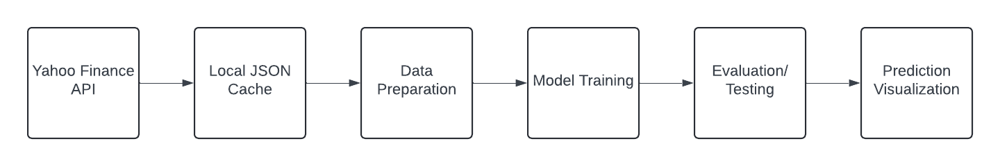

# COMS W3132 Individual Project

## Author
*Thea Wenyi Zhu
wz2636@columbia.edu*

## Project Title
*Predict The Stock Market With Machine Learning*

## Project Description
*The project aims to develop a predictive model for forecasting the MSFT  price using machine learning techniques. The reason why I picked this topic is because I have investing experiences, but I never get to learn how to use algorithmic trading to predict market. The primary problem it addresses is the tendency for stock price models to overfit, resulting in poor real-world performance. I used a Random Forest Classifier to predict whether the closing price of Microsoft will increase or decrease the following day. The project encompasses data acquisition, feature engineering, model training, backtesting, and evaluation to ensure robust predictive performance.* 

*Objectives: Download historical Microsoft stock data using the yfinance library. Prepare the dataset with relevant features, including rolling means, lagged values, and target labels. Train a Random Forest model to classify the stock price trend (up or down). Backtest the model over historical data to measure prediction performance. Visualize the results and generate insights.*

## Timeline

*To track progress on the project, we will use the following intermediate milestones for your overall project. Each milestone will be marked with a tag in the git repository, and we will check progress and provide feedback at key milestones.*

| Date               | Milestone                                                                                              | Deliverables                | Git tag    |
|--------------------|--------------------------------------------------------------------------------------------------------|-----------------------------|------------|
| **March&nbsp;29**  | Submit project description                                                                             | README.md                   | proposal   |
| **April&nbsp;5**   | Update project scope/direction based on instructor/TA feedback                                         | README.md                   | approved   |
| **April&nbsp;12**  | Basic project structure with empty functions/classes (incomplete implementation), architecture diagram | Source code, comments, docs | milestone1 |
| **April&nbsp;19**  | Progress on implementation (define your own goals)                                                     | Source code, unit tests     | milestone2 |
| **April&nbsp;26**  | Completely (or partially) finished implementation                                                      | Source code, documentation  | milestone3 |
| **May&nbsp;10**    | Final touches (conclusion, documentation, testing, etc.)                                               | Conclusion (README.md)      | conclusion |

*The column Deliverables lists deliverable suggestions, but you can choose your own, depending on the type of your project.*

## Requirements, Features and User Stories
*This project aims to predict stock market trends using historical Microsoft (MSFT) stock data and a Random Forest Classifier model. The historical data is downloaded using the yfinance library and cached in a JSON file for offline use. Feature engineering plays a crucial role in enhancing the predictive power, with features like rolling means (7, 90, and 365 days), weekly trends, and lagged stock prices (Open, High, Low, Close). A Random Forest Classifier is then trained to predict the closing price trend (up or down) based on these features. The model's performance is evaluated using precision, recall, and value counts through a backtesting function that validates predictions on historical data. Visualization of the last 100 days of predictions helps provide insights into the model's accuracy.*

*The requirements include access to historical Microsoft stock data, standard Python machine learning libraries (yfinance, sklearn, matplotlib, pandas), and sufficient computational resources for training the model. The project is structured to address key user stories: data scientists can download and cache stock data, machine learning engineers can incorporate advanced features to improve predictions, financial analysts can visualize the model's predictions over the last 100 days, and project reviewers can understand the entire workflow from data acquisition to model evaluation.*

## Technical Specification
*The project uses Python and relies on several libraries for data acquisition, feature engineering, and model training. The yfinance library is used to download historical MSFT stock data and cache it locally for repeated analysis. The pandas library is used for data manipulation and feature engineering, including rolling means (7, 90, and 365 days), lagged stock prices, and weekly trends.*

*A Random Forest Classifier is employed for model training, using parameters such as n_estimators=100 (number of trees), min_samples_split=200 (minimum samples to split a node), and random_state=1 (for reproducibility). The model is evaluated using precision and recall scores through the sklearn library. A backtesting function helps validate the model's performance by simulating predictions on historical data. The results are visualized using the matplotlib library, providing insights into the accuracy of predictions over the last 100 days.*

## System or Software Architecture Diagram

## Development Methodology
*Plan for Developing the Project:
I will use a GitHub Projects board to manage progress on tasks and milestones, and track issues for feature development.
GitHub Actions will automate testing and deployment pipelines.*

*Testing Plan:
Manual Testing: Visual inspections of plotted data features.
Automated Testing: Write unit tests with pytest to validate data preparation and model training functionality.*

*GitHub Features Usage:
Issues: Example issues include "Fix missing data" and "Improve model precision."
Actions: Automated testing through GitHub Actions.*

## Potential Challenges and Roadblocks
*Challenge 1: Acquiring High-Quality Data
Solution: Ensure that the data is accurate and complete by downloading it directly using yfinance. Also, cache data locally to avoid repeated downloads and ensure consistency.*

*Challenge 2: Data Preparation
Solution:
Handle missing data if any exists.
Use features that are predictive and carefully prepare the dataset.*
*Challenge 3: Model Tuning
Solution:
Optimize the RandomForestClassifier parameters using cross-validation.
Test different values of n_estimators, min_samples_split, and other hyperparameters.*
*Challenge 4: Model Evaluation and Overfitting
Solution:
Use a separate test set to evaluate the model.
Backtest the model using a rolling window approach.*

## Additional Resources
*Data Source:
Yahoo Finance API via yfinance: yfinance documentation
Tutorials and Guides:
RandomForestClassifier Documentation
Precision Score Evaluation*

## Conclusion and Future Work
*Conclusion
The RandomForest model achieved a reasonable precision score in predicting Microsoft's stock price direction.
The rolling window backtesting approach provided a realistic evaluation of the model's performance.
Future Work
Improvement 1: Tune the model's parameters for higher precision.
Improvement 2: Incorporate additional features (e.g., technical indicators, sentiment analysis).
Improvement 3: Expand the backtesting framework to include risk-adjusted metrics like Sharpe Ratio.*
